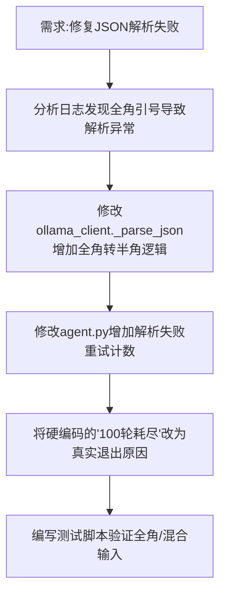

## 任务描述
修复 AI 模型（如 DeepSeek）输出全角标点导致 JSON 解析失败，以及解析失败后 Agent 错误退出（谎报轮数耗尽）的问题。

## 执行过程

## 任务总结
1. 在 `_parse_json` 中增加了全角标点（引号、逗号、冒号、括号）到半角的自动规范化逻辑，成功救回被误判的坏输出。
2. 优化 Agent 循环：解析失败不再立即 break，而是反馈纠错让 AI 重试，连续 5 次失败才放弃。
3. 修正 fallback 文案，准确报告退出原因（如'连续N轮解析失败'），避免误导用户。
