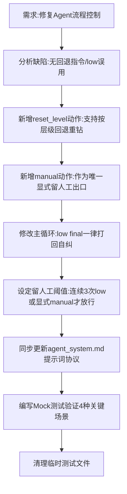

## 任务描述
修复图书编目 Agent 的流程控制缺陷：原逻辑中 Agent 走错分类分支无法回退，且将 confidence=low 错误地作为留人工出口，导致流程僵化。

## 执行过程

## 任务总结
完善了 Agent 的状态机与纠错能力：1. 新增 `reset_level` 允许 Agent 在发现分类路径错误时主动回退并重试；2. 新增 `manual` 动作作为唯一的合法留人工入口；3. 修正 `confidence=low` 语义，将其改为“打回自纠”信号，只有当 Agent 穷尽手段仍无法确定（连续3次low）或主动请求时才留人工，避免了错误的自动归档。
