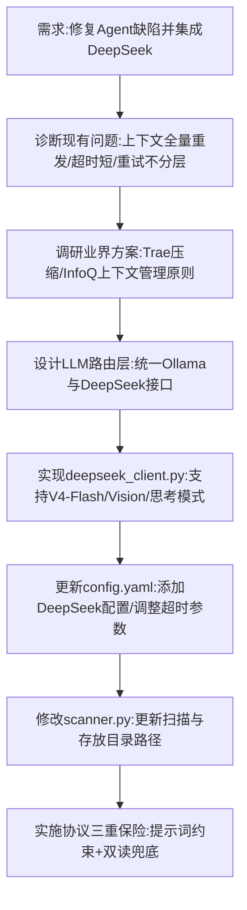

## 任务描述
重构 Agent 系统以解决上下文溢出、格式漂移等问题，并新增 DeepSeek API 支持（含视觉模型），同时调整扫描与存放路径。

## 执行过程

## 任务总结
1. **架构升级**：新建 `src/deepseek_client.py`，通过 OpenAI 兼容格式调用 DeepSeek V4-Flash 及 Vision 模型，支持自动切换思考模式与图片输入。
2. **上下文优化**：确立程序控制拼接策略，引入上下文压缩机制，避免服务端截断。
3. **稳定性增强**：细化错误分层重试（网络/工具/AI），增加超时时间至 30s/60s。
4. **配置更新**：在 `config.yaml` 中新增 DeepSeek 配置项，并在 `run_config.json` 中更新书籍扫描与存放路径。
