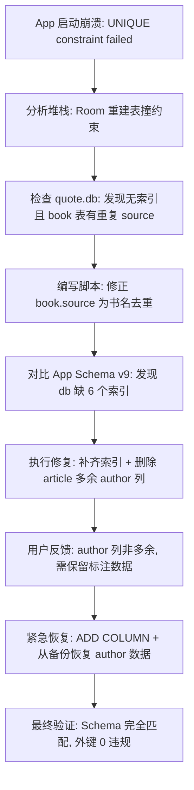

## 任务描述
修复 Android App 因 Room 数据库 Schema 不匹配导致的 UNIQUE constraint 崩溃。

## 执行过程

## 任务总结
成功修复数据库崩溃。关键教训：
1. **根因**：DB 缺失唯一索引 `index_book_kind_personId_source` 且存在重复数据，导致 Room 校验失败走重建路径。
2. **避坑**：不要仅凭 App 实体定义就删除 DB 列，需确认工具端是否使用该列（如 `article.author` 用于研究标注）。
3. **结果**：补齐 6 个索引，修正 20 本书的 source，恢复 author 列及数据。
