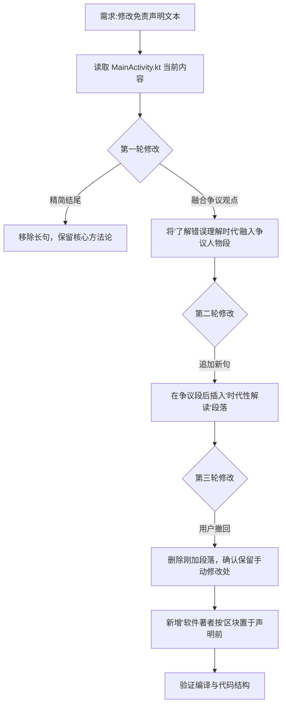

## 任务描述
在 Android 应用 MainActivity.kt 中，根据用户多轮反馈对免责声明及正文文本进行精细化迭代修改，包括精简结尾、融合争议人物观点、动态增删段落，并最终插入"软件著者按"区块。

## 执行过程

## 任务总结
成功完成多轮文本迭代：1. 精简结尾强调实践与方法；2. 将'通过错误理解时代'的逻辑无缝嵌入争议人物段；3. 响应撤回指令，精准定位并删除指定段落，保留用户手动修改点；4. 新增'软件著者按'独立区块，包含制作者态度与免责声明，排版上增加标题、分隔线与居中样式。
