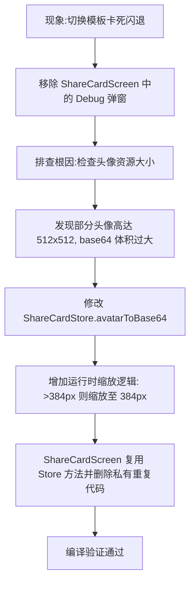

## 任务描述
解决 Android Compose 应用中切换分享模板时出现的卡顿与闪退问题。

## 执行过程

## 任务总结
定位到切换模板卡顿是由于大尺寸头像（如 512x512 PNG）转 Base64 后数据量过大，导致 JSON 注入 WebView 时解析缓慢甚至 OOM。通过在 `ShareCardStore.avatarToBase64` 中引入运行时缩放逻辑（统一限制最大边长 384px），有效控制了内存占用和序列化开销，解决了性能问题。
