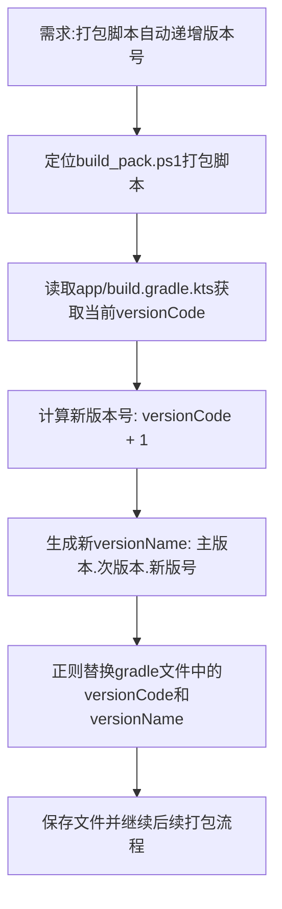

## 任务描述
解决 Android 应用打包时版本号固定导致的新旧包混淆问题，实现自动化版本管理。

## 执行过程

## 任务总结
在 PowerShell 打包脚本 `build_pack.ps1` 中增加了版本号自动递增逻辑：
1. 解析 `app/build.gradle.kts` 中的 `versionCode` 和 `versionName`。
2. `versionCode` 自动加 1。
3. `versionName` 格式调整为 `major.minor.versionCode`，确保每次打包生成的 APK 版本号唯一且递增，便于安装和版本追踪。
