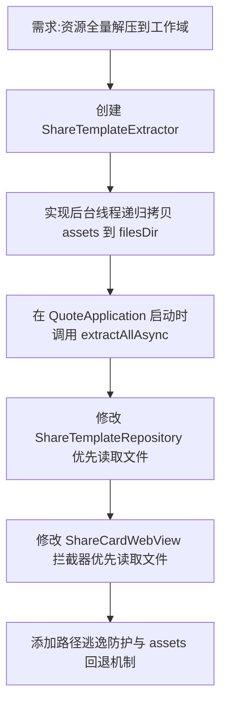

## 任务描述
解决 Android WebView 无法读取 APK assets 内 JS/CSS 文件的问题，将所有模板资源解压到应用私有文件目录（filesDir）。

## 执行过程

## 任务总结
成功实现资源工作域化：
1. 新增 `ShareTemplateExtractor` 对象，负责后台异步解压 `assets/share_templates/` 至 `files/share_templates/`。
2. 采用增量校验（文件大小比对）和半文件防护（写盘后校验）策略。
3. 所有读取逻辑（Repository、WebView 拦截器）均改为「文件优先，assets 兜底」，彻底解决 `openFd` 失败问题。
