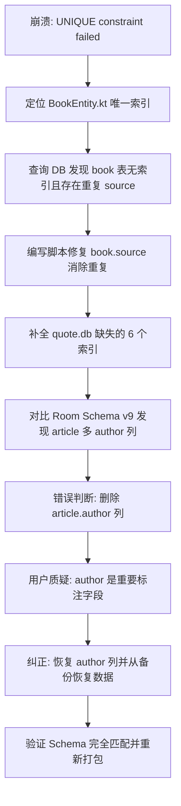

## 任务描述
解决 App 启动时因 SQLite 唯一约束失败导致的崩溃，并修复数据库 Schema 不一致问题。

## 执行过程

## 任务总结
1. **根因**: quote.db 缺失所有索引，Room 重建表时撞车唯一约束。
2. **修复**: 补齐 6 个索引，修正 20 本冲突书的 source 字段。
3. **教训**: 严禁仅根据 App 端 Entity 定义删除 DB 字段，必须检查工具链（scripts/）是否使用该字段。
