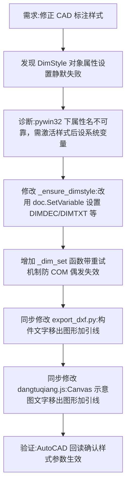

## 任务描述
修复 AutoCAD 标注样式设置失效问题，统一字体（HZTXT）、颜色（白字绿线）、箭头（建筑标记）、小数位（2 位）、文字位置（上方/对齐尺寸线），并修正前端 Canvas 示意图的文字引出标注。

## 执行过程

## 任务总结
成功解决 pywin32 操作 AutoCAD 时 `DimStyle` 对象属性设置静默失败的问题，改用 `doc.SetVariable` 设置系统变量（DIMDEC, DIMTXT, DIMBLK 等）确保样式生效。统一了 CAD 导出、DXF 导出及前端 Canvas 示意图的标注样式（2 位小数、白色文字、绿色线条、建筑标记箭头、文字位于尺寸线上方且对齐），并将构件名称改为引出标注形式避免覆盖图形。

---
## 修正段（2026-08-17 追加，经官方文档与实验验证）
上文"改用 SetVariable 确保样式生效"不完整：SetVariable 只产生文档级替代，必须再调用 `st.CopyFrom(doc)` 才持久化进样式对象（Autodesk ActiveX 官方标准做法）。此前"恢复激活样式后读回旧值"曾被误判为天正回滚，实为缺 CopyFrom。天正仅拦截 DIMTXSTY 一个变量（无法绕开，标注为纯数字故接受图纸默认字体）。最终 _ensure_dimstyle 流程：激活样式 → SetVariable（带重试）→ st.CopyFrom(doc) → 恢复原激活样式。验证：切走再切回值保持，7 个标注对象回读 TextHeight=0.09、VerticalTextPosition=1、对齐=尺寸线、颜色箭头正确。
