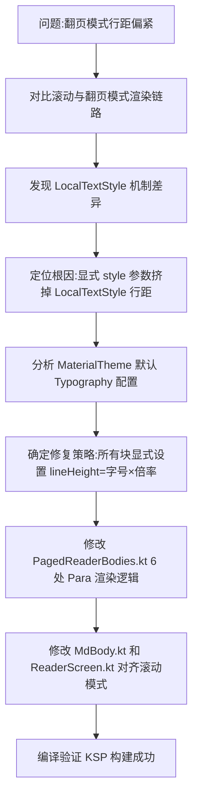

## 任务描述
修复 Android Compose 阅读器中翻页模式与滚动模式行距不一致的问题。

## 执行过程

## 任务总结
根因是 Compose Text 显式传入 style 参数会替换 LocalTextStyle，导致依赖该上下文的行距退化为自然行高。修复方案是在翻页端 (PagedReaderBodies.kt) 和滚动端 (MdBody.kt, ReaderScreen.kt) 的所有 Text 组件中，显式设置 lineHeight = fontSize * lineHeightRatio，确保两端行距公式完全一致且随设置动态变化。
