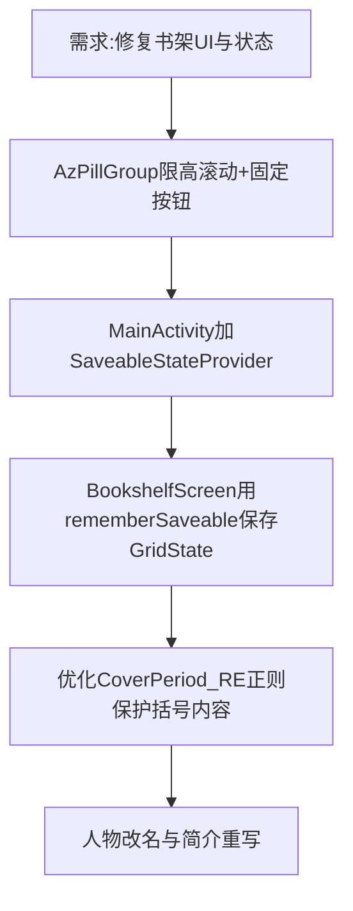

## 任务描述
修复书架展开列表溢出、Tab切换丢失滚动位置及书名解析异常等UI问题。

## 执行过程

## 任务总结
1. **AzPillGroup**：展开区限制最大高度比例并启用垂直滚动，收起按钮置于 BoxWithConstraints 外部确保永远可见。
2. **状态保持**：MainActivity 中使用 `SaveableStateProvider(tab)` 包裹页面，配合 `LazyGridState.Saver` 实现切 Tab/阅读页后恢复滚动位置。
3. **正则优化**：`COVER_PERIOD_RE` 排除括号字符，`COVER_PAREN_RE` 整体保护 `(时期)` 块，避免书名被截断。
