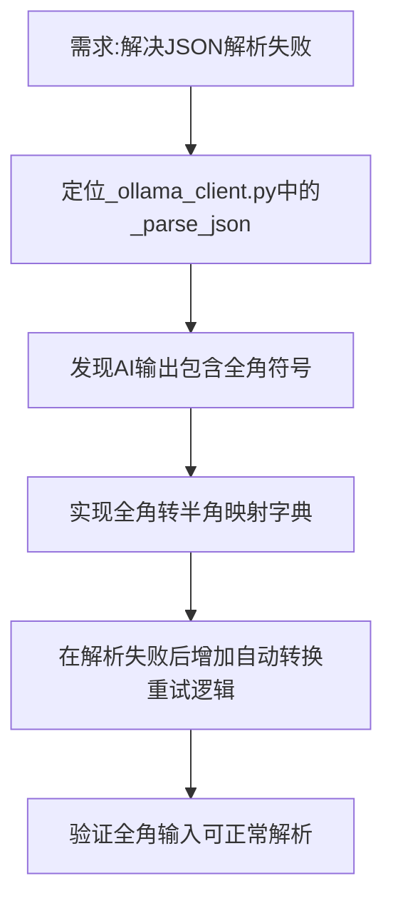

## 任务描述
解决 JSON 解析中因 AI 输出全角字符（如全角引号、逗号）导致的解析失败问题。

## 执行过程

```mermaid
graph TD
    A[需求:解决JSON解析失败] --> B[定位_ollama_client.py中的_parse_json]
    B --> C[发现AI输出包含全角符号]
    C --> D[实现全角转半角映射字典]
    D --> E[在解析失败后增加自动转换重试逻辑]
    E --> F[验证全角输入可正常解析]
```

## 任务总结
在 `_parse_json` 中增加了容错机制：当 JSON 解析失败时，自动将全角引号、逗号、冒号、花括号等转换为半角字符后重试。这有效解决了大模型输出格式不规范导致的程序崩溃问题，无需依赖外部重试。
