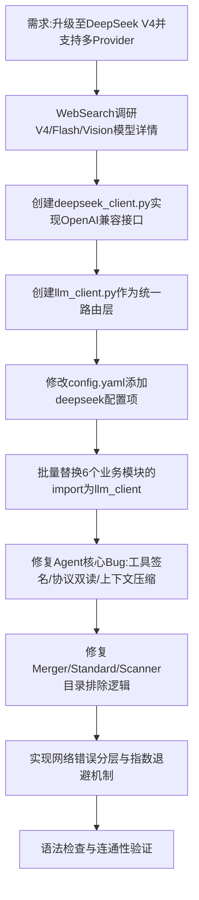

## 任务描述
根据最新 API 文档将 LLM 后端从 Ollama 扩展支持 DeepSeek V4 系列（含视觉模型），并修复 Agent 核心缺陷。

## 执行过程

## 任务总结
成功实现 LLM 路由切换功能，默认使用 deepseek-v4-flash，图片自动切换 vision-exp。修复了 Agent 工具调用 TypeError、JSON 解析兼容性、上下文超限崩溃等严重问题，增强了系统的稳定性和容错能力。
