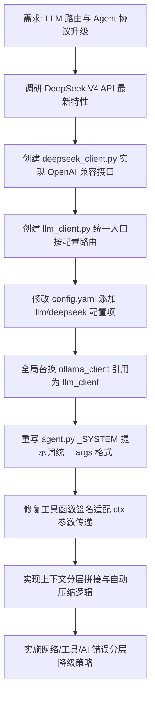

## 任务描述
重构 LLM 调用层以支持 DeepSeek V4 API 并与 Ollama 无缝切换，同时升级 Agent 协议以解决上下文溢出和格式漂移问题。

## 执行过程

## 任务总结
成功实现 LLM 提供商热切换（Ollama/DeepSeek），默认使用 DeepSeek V4 Flash 模型；Agent 协议升级为严格 JSON 格式（所有参数在 args 内），通过程序控制上下文拼接避免截断，并增强了错误处理的鲁棒性。
