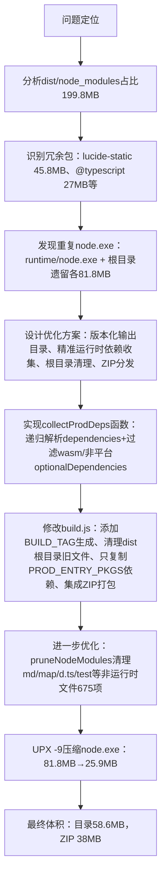

## 任务描述
优化照片排版软件的打包体积（原363MB），解决 node_modules 冗余、重复 node.exe、输出目录混杂等问题。

## 执行过程

## 任务总结
成功将打包体积从363MB缩减至58.6MB（ZIP 38MB）：通过重构build.js，实现版本化输出目录（如照片排版-v1.0.0-20240810-1530/）、仅打包server.js实际依赖的9个运行时包（剔除devDependencies及跨平台二进制）、自动清理dist根目录历史残留、pruneNodeModules删除文档测试类文件、UPX压缩便携node.exe（82→26MB，压缩后运行正常含sharp原生模块）、并生成ZIP分发包。

## 关键经验
- 便携 node.exe 可安全用 UPX -9 压缩，压缩后 express/sharp/pdfkit 均正常，收益约 55MB
- sharp 的 optionalDependencies 只保留当前平台已安装的非 wasm 包（@img/sharp-win32-x64）
- pruneNodeModules 必须跳过 @img 目录（原生模块内部结构不能动）
- 版本化输出目录构建前需清理 dist 根目录无版本旧目录（node_modules/public/runtime）与散落文件
