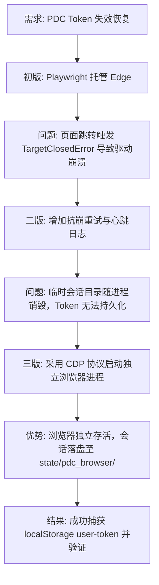

## 任务描述
为 PDC 平台开发自动化登录器，解决 Token 失效后人工干预繁琐的问题，实现弹窗登录、自动抓取 Token 并写入共享状态。

## 执行过程

## 任务总结
开发了 `pdc_login.py` v3 版本。核心改进是放弃 Playwright 托管模式，改用 `subprocess` 启动带 `--remote-debugging-port=9223` 的独立 Edge 进程。通过 WebSocket (websocket-client) 连接 CDP 端口轮询 `localStorage.getItem('user-token')`。即使窗口关闭，也能从磁盘持久化的 DevTools Profile 中打捞 Token。
