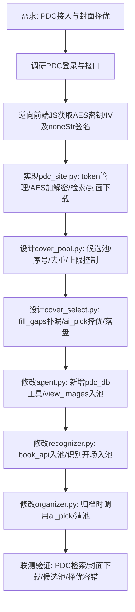

## 任务描述
接入中国国家版本数据中心（PDC）作为中图分类参考源与高清封面数据源，并实现封面候选择优机制。

## 执行过程

## 任务总结
1. **PDC接入**：实现 AES-CBC 协议逆向（key=`zg35ws76swnxz679`, iv=`z66qa18l0w9o521k`），支持 token 自动管理与失效人工指引；提供 `pdc_db` 工具供 AI 查询中图分类号与元数据。
2. **封面择优**：建立 5 个收集点（PDC/book_api/view_images/程序截页/补漏），自动编号暂存；归档时触发单独 AI 会话择优（≥2候选），失败或无候选则落原兜底链。
3. **验证**：PDC 检索《活着》得分 85，封面原图下载正常，编译全过。
