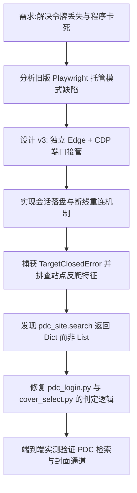

## 任务描述
重构 PDC 登录器以解决 playwright 崩溃导致的令牌丢失问题，并修复因 API 响应类型误判导致的验证失败及 PDC 通道失效。

## 执行过程

## 任务总结
1. **架构升级**：放弃 Playwright 托管，改用独立浏览器进程 + CDP (9223) 采集，确保工具崩溃不影响浏览器，且支持从磁盘 Local Storage 打捞令牌。
2. **Bug 修复**：识别出 `pdc_site.search` 成功时返回 `dict`（含 `list` 字段），原代码按 `list` 判定导致永远认不出成功。已同步修复登录器验证逻辑与封面判断通道的调用逻辑。
3. **结果**：v3 版本稳定运行，新令牌一次验证通过，PDC 封面通道恢复正常。
