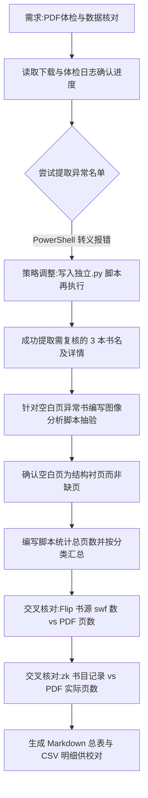

## 任务描述
对 202 个 PDF 进行逐页体检（检查空白/坏页/尺寸异常），统计总页数，并与源文件及书目清单交叉核对，最终生成校对用的总表和明细表。

## 执行过程

## 任务总结
成功完成全库体检：总页数 25,572 页。发现 3 本需复核，经图像分析确认为正常结构。18 本 Flip 书及多数书籍页数与源文件或书目记录完全一致。解决了 PowerShell 下 Python 字符串转义导致的执行失败问题（改用独立脚本文件）。最终输出《PDF 体检总表.md》和《PDF 页数对照表.csv》，数据准确可靠。
