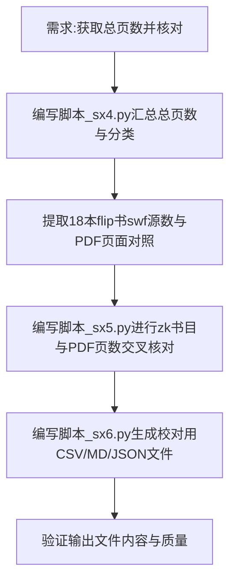

## 任务描述
对全库202个PDF进行体检，获取总页数，并与源文件（swf）及书目清单（zk）进行交叉核对，最终生成供人工校对的存档文件。

## 执行过程

## 任务总结
成功完成全库体检与核对：
1. **数据汇总**：确认202个PDF共25,572页，按站点分类统计。
2. **源文件核对**：18本flip书实现“swf+封面=PDF页数”的精确匹配。
3. **交叉核对**：将PDF页数与zk书目记录比对，标记差异。
4. **成果输出**：生成`PDF页数对照表.csv`（含空白页号等明细）、`PDF体检总表.md`（汇总报告）及原始JSON数据，存放于下载输出目录。
