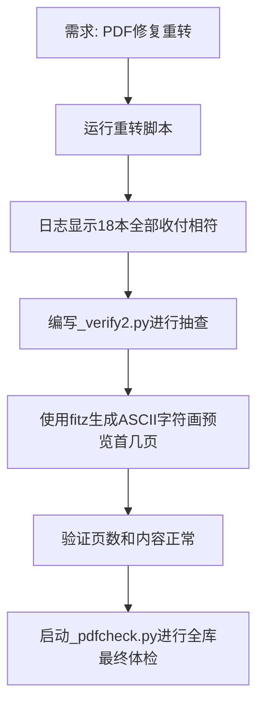

## 任务描述
完成18本PDF的修复重转，并进行最终的质量验收。

## 执行过程

```mermaid
graph TD
    A[需求: PDF修复重转] --> B[运行重转脚本]
    B --> C[日志显示18本全部收付相符]
    C --> D[编写_verify2.py进行抽查]
    D --> E[使用fitz生成ASCII字符画预览首几页]
    E --> F[验证页数和内容正常]
    F --> G[启动_pdfcheck.py进行全库最终体检]
```

## 任务总结
成功完成18本PDF修复，通过ASCII字符画抽查确认内容无误。建立了'页数核对+视觉抽查+全库扫描'的三级验证体系。
