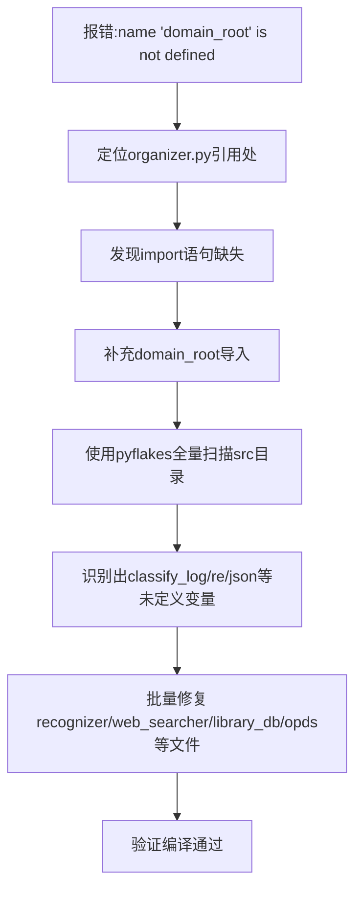

## 任务描述
排查并修复因缺少 import 导致的运行时 NameError 错误，建立预防机制。

## 执行过程

## 任务总结
修复了 organizer.py 中 domain_root 未导入的潜伏 Bug。通过 pyflakes 静态扫描发现了 recognizer.py (classify_log)、web_searcher.py (re)、library_db.py (json)、opds.py (json/title) 等多处同类未定义变量问题并全部修复。建议在后续开发中，将 pyflakes 加入常规检查流程，避免此类仅在特定执行路径下触发的错误。
