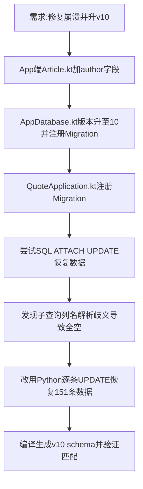

## 任务描述
修复因 App Schema 不匹配导致的 UNIQUE 崩溃，并完成 v10 升级及 author 数据恢复。

## 执行过程

## 任务总结
成功消除崩溃根因：
1. **Schema升级**：App端增加 `author` 字段，版本升至 v10，注册 Migration 防止旧库重建。
2. **数据恢复**：修正了 SQL 子查询歧义 Bug，通过 Python 逐行更新恢复了 151 篇作者标注。
3. **打包发布**：v1.32 版本三档打包成功，Schema 全量验证通过。
