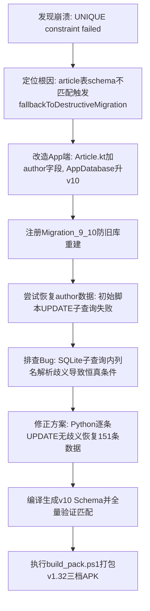

## 任务描述
修复 App 因 Room Schema 不匹配导致的 UNIQUE constraint 崩溃，并完成 v1.32 版本发布。

## 执行过程

```mermaid
graph TD
    A[发现崩溃: UNIQUE constraint failed] --> B[定位根因: article表schema不匹配触发fallbackToDestructiveMigration]
    B --> C[改造App端: Article.kt加author字段, AppDatabase升v10]
    C --> D[注册Migration_9_10防旧库重建]
    D --> E[尝试恢复author数据: 初始脚本UPDATE子查询失败]
    E --> F[排查Bug: SQLite子查询内列名解析歧义导致恒真条件]
    F --> G[修正方案: Python逐条UPDATE无歧义恢复151条数据]
    G --> H[编译生成v10 Schema并全量验证匹配]
    H --> I[执行build_pack.ps1打包v1.32三档APK]
```

## 任务总结
成功消除崩溃根因：App端Schema升至v10并注册Migration，从C盘副本恢复151篇author标注（避开SQL子查询歧义坑），验证五表Schema全匹配后打包v1.32。
