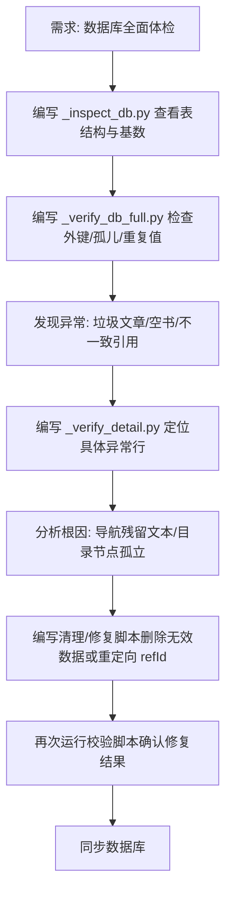

## 任务描述
对 SQLite 数据库进行全量完整性体检，修复孤儿数据、断链及脏数据。

## 执行过程

```mermaid
graph TD
    A[需求: 数据库全面体检] --> B[编写 _inspect_db.py 查看表结构与基数]
    B --> C[编写 _verify_db_full.py 检查外键/孤儿/重复值]
    C --> D[发现异常: 垃圾文章/空书/不一致引用]
    D --> E[编写 _verify_detail.py 定位具体异常行]
    E --> F[分析根因: 导航残留文本/目录节点孤立]
    F --> G[编写清理/修复脚本删除无效数据或重定向 refId]
    G --> H[再次运行校验脚本确认修复结果]
    H --> I[同步数据库]
```

## 任务总结
完成 5 张核心表的交叉校验，清理 3 篇导航残留垃圾文章，修复《美国共产党史》目录指向错误，确保书籍、文章、目录间引用关系完整一致。
