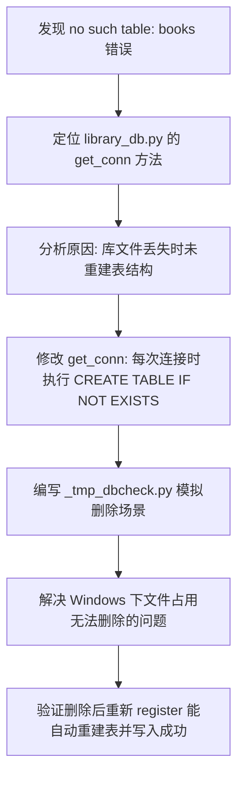

## 任务描述
解决 SQLite 数据库文件被意外删除或丢失后，程序因找不到表而报错的问题。

## 执行过程

```mermaid
graph TD
    A[发现 no such table: books 错误] --> B[定位 library_db.py 的 get_conn 方法]
    B --> C[分析原因: 库文件丢失时未重建表结构]
    C --> D[修改 get_conn: 每次连接时执行 CREATE TABLE IF NOT EXISTS]
    D --> E[编写 _tmp_dbcheck.py 模拟删除场景]
    E --> F[解决 Windows 下文件占用无法删除的问题]
    F --> G[验证删除后重新 register 能自动重建表并写入成功]
```

## 任务总结
在 `library_db.py` 的 `get_conn()` 中增加了幂等 DDL 逻辑。现在无论数据库文件是否丢失，只要调用 `get_conn` 或任何写入口，都会自动确保 `books` 表存在，彻底免疫因文件清理导致的崩溃。
