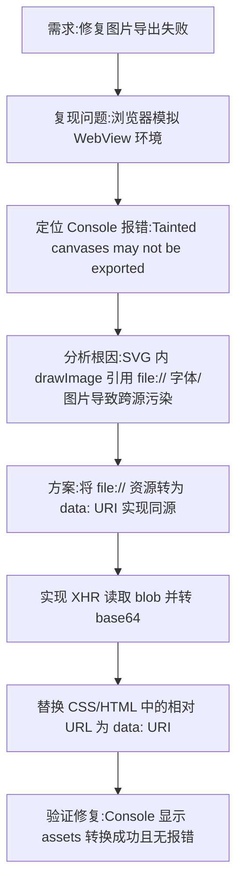

## 任务描述
修复 Android WebView 中分享卡片图片导出时因引用本地 file:// 资源导致的 SecurityError (Tainted canvases)。

## 执行过程

## 任务总结
成功解决导出失败问题：在 share_core.js 中增加 resource absolutize 和 convertOne 逻辑，通过 XHR 读取 file:// 资源转为 data: URI，消除 Canvas 跨源污染，确保 toDataURL 可正常执行。
