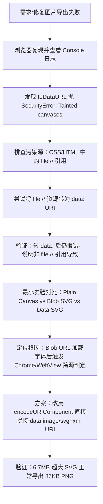

## 任务描述
修复分享卡片图片导出功能中的 SecurityError 错误（Tainted canvases may not be exported），解决超高卡片内容无法生成 PNG 的问题。

## 执行过程

## 任务总结
成功修复导出功能。根本原因是 Blob URL (`URL.createObjectURL`) 加载包含字体的 SVG 文档时，被浏览器判定为跨源导致画布污染。解决方案是将 SVG 字符串通过 `encodeURIComponent` 转换为 `data:image/svg+xml;charset=utf-8,` 前缀的 URI 赋值给 img.src，确保同源安全。同时保留了对 CSS/HTML 中相对 URL 的资源转 base64 处理逻辑。
