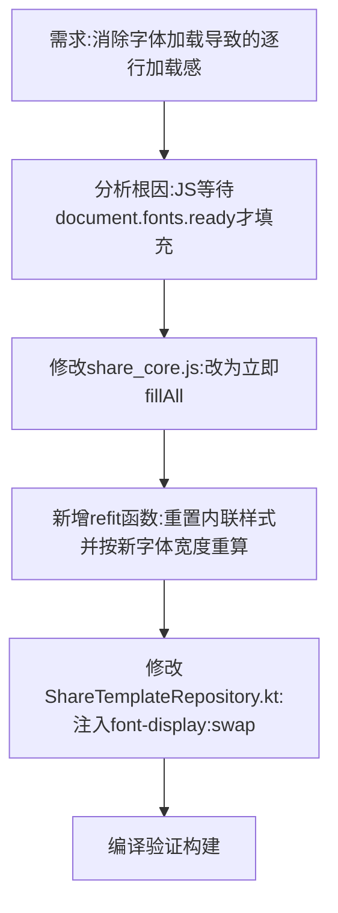

## 任务描述
解决移动端 WebView 中因等待 @font-face 字体加载导致的页面逐行加载（类似图片缓慢加载）问题，改为立即用回退字体渲染，字体就绪后再进行排版校正。

## 执行过程

## 任务总结
成功优化字体渲染策略：
1. **JS层**：移除对 `document.fonts.ready` 的阻塞等待，改为立即渲染；字体就绪后调用 `refit()` 重置内联样式（fontSize, letterSpacing等）并重新适配布局。
2. **Kotlin层**：在 `loadHtml` 方法中通过正则将 `@font-face` 替换为 `@font-face{font-display:swap;`，确保浏览器优先显示回退字体。
3. 效果：页面一步到位显示文字，无空白等待，无整卡重排闪烁。
