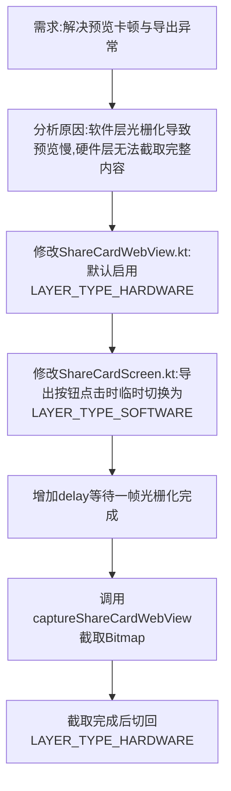

## 任务描述
解决 Android WebView 分享卡片预览卡顿及导出图片失败（黑屏/空白）的问题。

## 执行过程

## 任务总结
实现了 WebView 渲染层的动态切换策略：
1. **预览阶段**：使用 `View.LAYER_TYPE_HARDWARE` (GPU)，利用硬件加速提升滚动和缩放性能，解决卡顿。
2. **导出阶段**：在点击导出按钮时，临时切换为 `View.LAYER_TYPE_SOFTWARE` (CPU)，确保 `view.draw()` 能捕获到完整的 WebView 内容（包括超出屏幕部分），避免黑屏或截断。截取完成后立即切回硬件层。
