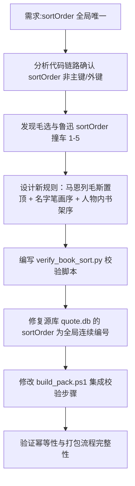

## 任务描述
解决 book 表 sortOrder 跨人物重复问题，实现全局唯一连续编号，并将校验逻辑集成到打包流程中。

## 执行过程

## 任务总结
成功实现 sortOrder 全局唯一化：人物按「马恩列毛斯置顶 + 笔画序」排列，人物内按类别/出版年份/卷序排列，全局从 1 连续编号。新增 scripts/verify_book_sort.py 脚本，在打包流程中自动校验并修复，确保「全部」筛选页可直接按 sortOrder 排序得到正确顺序，无需 UI 层额外逻辑。
