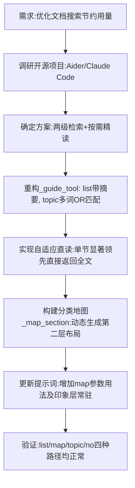

## 任务描述
优化本地《分类决断指南》检索工具（guide），借鉴 Aider repo-map 和 Claude Code grep→read 模式，解决全量塞入浪费 token 的问题；并构建“三层地图”架构（印象层、布局层、细节层）辅助 AI 导航。

## 执行过程

## 任务总结
成功实现 guide 工具的两级检索：
1. **第一级（低成本）**：`list` 返回带首行摘要的目录；`topic` 支持多词 OR 检索，命中多时仅返回清单。
2. **第二级（按需）**：`no` 精读单节；若单节命中或分数显著领先，直接返回全文省一轮。
3. **地图架构**：新增 `map` 参数，支持查看 22 大类一览或某类第二层划分布局（如 O 类按数理分支分，B 类按地域/学科分），AI 据此下钻，避免盲目猜测。
4. **效果**：大幅降低无效 token 消耗，提升定位准确率。
