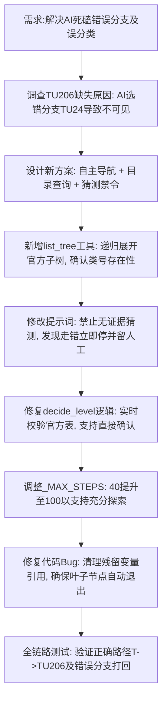

## 任务描述
重构中图分类AI逻辑，解决AI在错误分支死磕、无法识别叶子节点及强制下钻导致误分类的问题。

## 执行过程

## 任务总结
成功实施中图分类AI逻辑重构：
1. 新增 `list_tree` 工具，允许AI查看完整类目树，避免在错误分支（如TU24）中迷失。
2. 引入【猜测禁令】和【有证据先验证】规则，禁止AI在无确切证据时硬凑分类。
3. 修正 `decide_level` 逻辑，实现叶子节点自动退出，不再强制下钻。
4. 将最大动作轮数 `_MAX_STEPS` 提升至 100，确保AI有足够时间探索。
5. 解决了TU206等深层类号因分支选择错误而不可见的问题。
