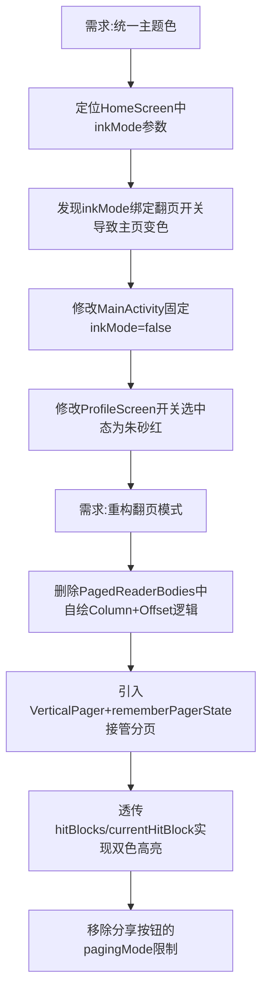

## 任务描述
1. 统一应用主题色为白红（暖纸+朱砂红），解决主页按钮随翻页模式切换变黑的问题。
2. 重构翻页阅读模式，删除自绘分页容器，改用官方 VerticalPager，并补齐搜索高亮与分享功能。

## 执行过程

```mermaid
graph TD
    A[需求:统一主题色] --> B[定位HomeScreen中inkMode参数]
    B --> C[发现inkMode绑定翻页开关导致主页变色]
    C --> D[修改MainActivity固定inkMode=false]
    D --> E[修改ProfileScreen开关选中态为朱砂红]
    E --> F[需求:重构翻页模式]
    F --> G[删除PagedReaderBodies中自绘Column+Offset逻辑]
    G --> H[引入VerticalPager+rememberPagerState接管分页]
    H --> I[透传hitBlocks/currentHitBlock实现双色高亮]
    I --> J[移除分享按钮的pagingMode限制]
```

## 任务总结
成功统一全局白红主题；翻页模式底层替换为官方 Pager 库，解决了手势冲突问题，并实现了搜索高亮与分享的跨模式兼容。
