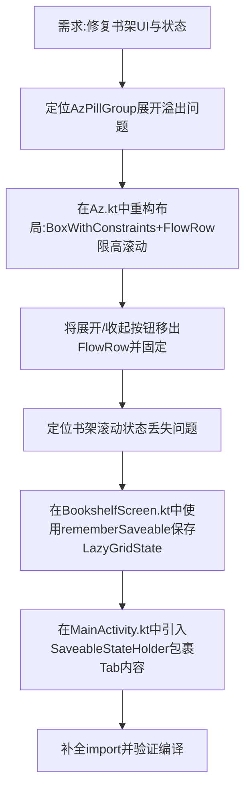

## 任务描述
修复书架页面AzPillGroup展开后收起按钮不可见的问题，以及Tab切换时书架滚动位置丢失的问题。

## 执行过程

## 任务总结
1. **AzPillGroup优化**：在 `Az.kt` 中使用 `BoxWithConstraints` 限制展开区最大高度（40%），内部 `FlowRow` 支持垂直滚动，并将“展开/收起”按钮固定在区域外，确保操作入口始终可见。
2. **状态保持**：在 `BookshelfScreen.kt` 中使用 `rememberSaveable(saver = LazyGridState.Saver)` 保存网格滚动位置；在 `MainActivity.kt` 中使用 `SaveableStateProvider(tab)` 包裹各Tab Composable，确保切回书架时恢复原滚动位置。
