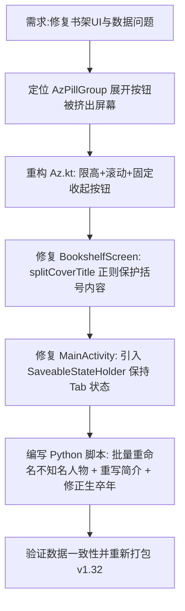

## 任务描述
修复 App v1.32 版本中的四个遗留问题：1. 书架人物筛选展开后无法收起；2. 列宁等部分书籍封面标题显示异常（括号截断）；3. 从阅读页返回书架时滚动位置丢失；4. 人物简介混乱及命名不规范。

## 执行过程

## 任务总结
1. **UI 修复**：AzPillGroup 增加高度限制与垂直滚动，确保“收起”按钮始终可见；修复书名解析正则，避免括号内连字符导致标题截断；通过 SaveableStateProvider 解决切 Tab 丢失滚动位置的问题。
2. **数据修复**：将 40+ 位不知名人物（如本雅明、葛兰西等）由常用名改为全名；重写 20+ 位知名人物的简介，清除爬虫残留垃圾文本；修正谢山等矛盾的生卒年数据。
3. **避坑指南**：在 SQLite 跨库更新中，避免使用 `UPDATE ... SET col = (SELECT ... WHERE old.id = id)` 这种写法，因为子查询内的列名可能被解析为内部表导致恒真条件，应改用 Python 逐条 UPDATE。
