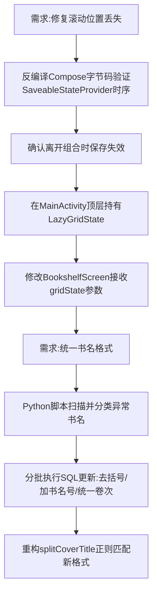

## 任务描述
修复书架页从阅读页返回时滚动位置重置为顶部的问题；并将数据库中所有选集/文集类书名的格式统一为毛选集风格（《书名》第X卷 时期），以适配封面渲染逻辑。

## 执行过程

## 任务总结
1. **滚动修复**：将 `LazyGridState` 提升至 `MainActivity` 层级持有，避免依赖 `SaveableStateProvider` 的不可靠时序。
2. **数据统一**：完成 122 本书名格式化（含列宁、托洛茨基等 12 个系列及单选本），两库同步且备份齐全。
3. **代码适配**：更新 `COVER_VOLUME_RE`、`COVER_PAREN_RE` 和 `COVER_SEP_RE` 正则，支持中文数字卷次及括号内年份区间。
