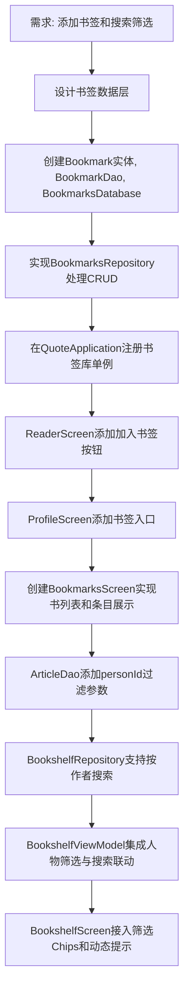

## 任务描述
为应用添加用户书签（收藏）功能和搜索作者筛选功能。

## 执行过程

## 任务总结
成功实现书签系统：
1. **数据安全**：书签存独立 `bookmarks.db`，避免内容库覆盖丢失。
2. **快照机制**：书签实体存储书名、作者、篇目标题快照，确保内容更新后仍可显示。
3. **去重策略**：利用唯一索引防止重复收藏。
4. **搜索联动**：书架搜索范围跟随当前选中人物，提供“全部/鲁迅/毛泽东”等筛选胶囊。
5. **UI交互**：阅读页分享栏旁新增“加入书签”按钮；我的页新增书签入口，支持按书浏览、作者筛选、分页查看和删除。
