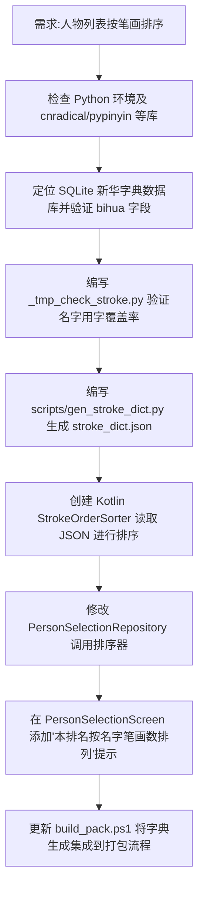

## 任务描述
为 App 人物列表实现按名字笔画排序功能，并在 UI 增加说明提示。

## 执行过程

## 任务总结
成功实现人物列表笔画排序：通过 Python 脚本从新华字典提取人物名字用字的笔画数生成 assets/stroke_dict.json；Kotlin 端实现 StrokeOrderSorter 读取该字典并按逐字笔画序列排序（同笔画按 id 升序）；UI 层增加文字提示；打包脚本自动同步字典。
