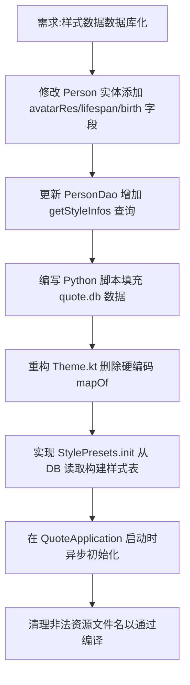

## 任务描述
将 App 中硬编码在 Theme.kt 里的 147 个人物头像样式（avatarRes/lifespan/birth）迁移至 SQLite 数据库，实现样式数据的动态加载。

## 执行过程

```mermaid
graph TD
    A[需求:样式数据数据库化] --> B[修改 Person 实体添加 avatarRes/lifespan/birth 字段]
    B --> C[更新 PersonDao 增加 getStyleInfos 查询]
    C --> D[编写 Python 脚本填充 quote.db 数据]
    D --> E[重构 Theme.kt 删除硬编码 mapOf]
    E --> F[实现 StylePresets.init 从 DB 读取构建样式表]
    F --> G[在 QuoteApplication 启动时异步初始化]
    G --> H[清理非法资源文件名以通过编译]
```

## 任务总结
完成了样式预设从代码硬编码到数据库驱动的迁移，消除了 270+ 行冗余代码，提升了可维护性。同时修复了因 Windows 复制产生的非法资源文件名导致的编译错误。
