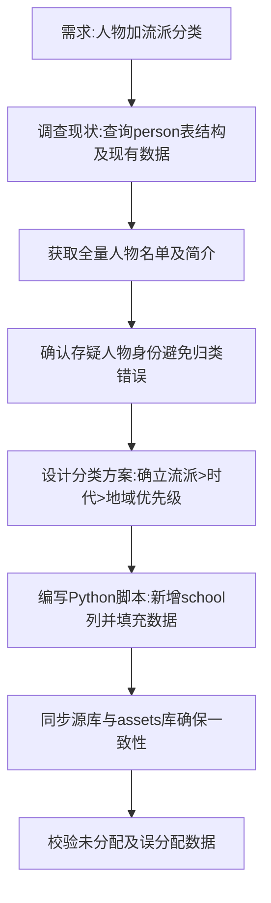

## 任务描述
为人物列表添加"流派"分类字段，并在选择界面显示流派徽标，分类优先级为：思想流派 > 时代 > 地域。

## 执行过程

## 任务总结
成功实现人物流派分类功能：在 person 表新增 school 字段，依据思想流派优先原则将 150 位人物归入马列、托派、西马等类别；通过 Python 脚本双库同步数据，并校验了未分配和误分配情况，为 UI 显示流派徽标提供数据基础。
