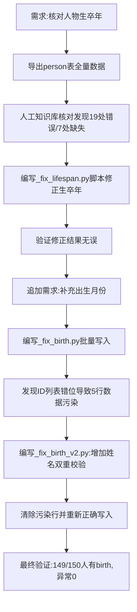

## 任务描述
对人物数据库进行生卒年及出生月份数据的全面核对与修正，解决导入导致的年份错乱及出生月份缺失问题。

## 执行过程

## 任务总结
成功修正19处生卒年错误，补充7处缺失生卒年，并为147位人物补充出生月份。关键经验：在批量更新数据库时，若依赖ID映射，必须防止ID列表错位；脚本内需加入"姓名双重校验"机制（SELECT name比对预期姓名），一旦不符立即中止，避免错误数据污染。所有操作前自动备份数据库。
