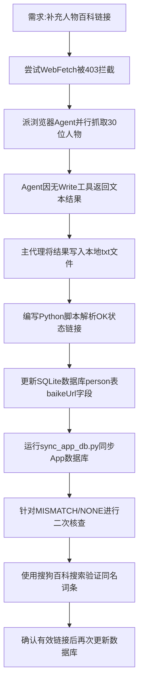

## 任务描述
为项目人物库批量补充百度百科及搜狗百科链接。

## 执行过程

```mermaid
graph TD
    A[需求:补充人物百科链接] --> B[尝试WebFetch被403拦截]
    B --> C[派浏览器Agent并行抓取30位人物]
    C --> D[Agent因无Write工具返回文本结果]
    D --> E[主代理将结果写入本地txt文件]
    E --> F[编写Python脚本解析OK状态链接]
    F --> G[更新SQLite数据库person表baikeUrl字段]
    G --> H[运行sync_app_db.py同步App数据库]
    H --> I[针对MISMATCH/NONE进行二次核查]
    I --> J[使用搜狗百科搜索验证同名词条]
    J --> K[确认有效链接后再次更新数据库]
```

## 任务总结
成功通过浏览器Agent抓取并人工/脚本校验，最终为123位人物补充了百科链接。其中57人来自百度百科，6人来自搜狗百科（含纠正了梁赞诺夫等错误链接）。剩余26人无词条或无法确认身份，保持空白。
