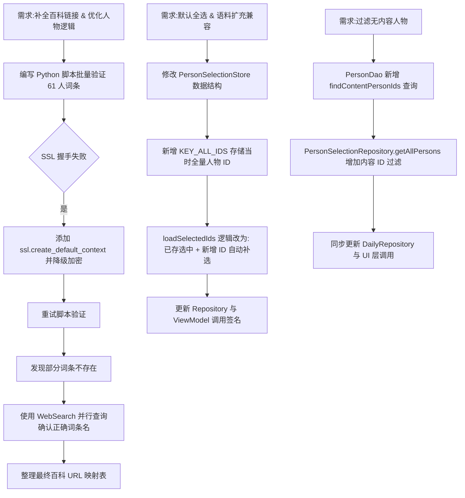

## 任务描述
为哲学小测试 App 实现人物百科链接批量验证与补全，同时优化人物选择逻辑：支持语料扩充后自动补选新增人物，并将无语录/文章内容的「预备役」人物从展示列表中过滤。

## 执行过程

## 任务总结
1. **百科链接**: 修复 SSL 握手问题，通过 WebSearch 批量验证并修正了阿尔都塞、季诺维也夫等 10+ 个词条名称，生成最终 URL 映射。
2. **全选逻辑**: 采用「保存全量 ID + 增量补选」策略，确保语料库扩充后新增人物自动进入默认选中池，旧用户数据平滑兼容。
3. **预备役过滤**: 通过 `UNION SELECT` 查询语录与文章表获取有效人物 ID，在 Repository 层统一过滤，确保书架、选择页、每日推荐均不展示无内容人物。
