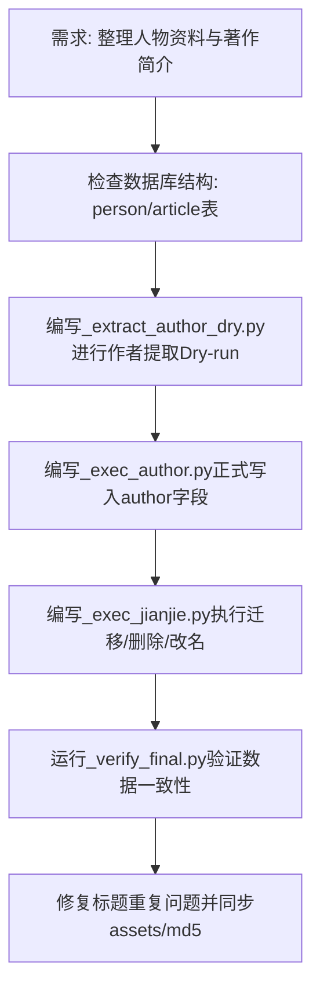

## 任务描述
1. 为汇编类文章提取真实作者，无作者则赋值为“编者”。
2. 将5本零散文章集合的书名改为“XX文选”。
3. 删除《卢森堡著作简介》和《托洛茨基著作简介》两本书，将其中的导介短文作为序言移入对应卷开头，长文移至卷末。
4. 确保出版物书籍内容不被修改，仅处理非出版物。

## 执行过程

## 任务总结
成功为12本汇编提取作者（90篇署名，48篇编者）；重命名5本文选；删除2本简介书，迁移46篇文章至对应卷（序言置顶，长文置底）；验证孤儿节点为0，数据完整性通过。
