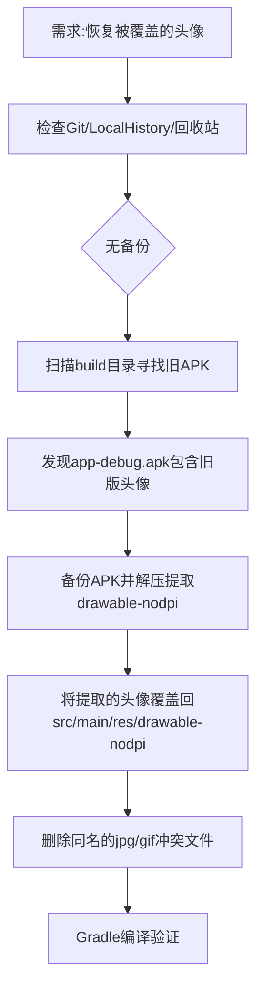

## 任务描述
恢复被错误覆盖的 Android 项目头像资源（PNG 格式）。

## 执行过程

```mermaid
graph TD
    A[需求:恢复被覆盖的头像] --> B[检查Git/LocalHistory/回收站]
    B --> C{无备份}
    C --> D[扫描build目录寻找旧APK]
    D --> E[发现app-debug.apk包含旧版头像]
    E --> F[备份APK并解压提取drawable-nodpi]
    F --> G[将提取的头像覆盖回src/main/res/drawable-nodpi]
    G --> H[删除同名的jpg/gif冲突文件]
    H --> I[Gradle编译验证]
```

## 任务总结
成功从旧 APK (`app-debug.apk`) 中提取并恢复了 60 个头像资源（10个 png + 50个 jpg），清理了 10 个错误的 jpg/gif 副本，项目编译通过。
