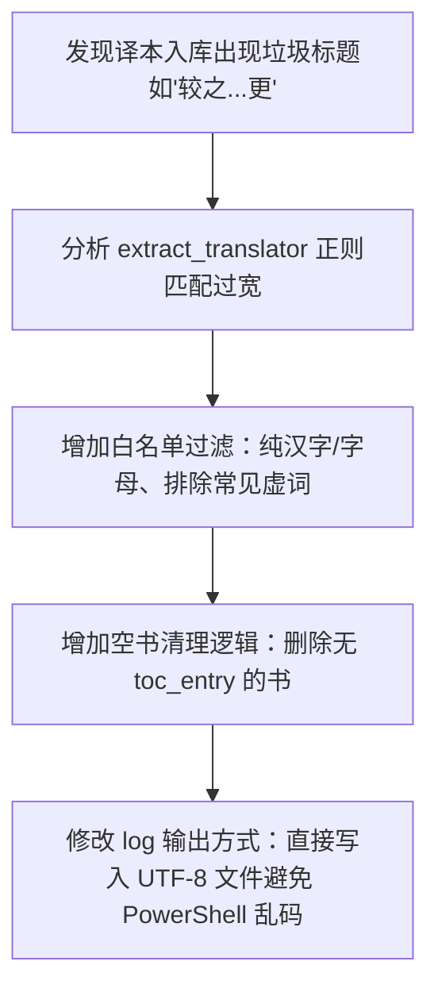

## 任务描述
优化 rebuild_catalog.py 的译本标题识别逻辑，增加空书清理功能。

## 执行过程

```mermaid
graph TD
    A[发现译本入库出现垃圾标题如'较之...更'] --> B[分析 extract_translator 正则匹配过宽]
    B --> C[增加白名单过滤：纯汉字/字母、排除常见虚词]
    C --> D[增加空书清理逻辑：删除无 toc_entry 的书]
    D --> E[修改 log 输出方式：直接写入 UTF-8 文件避免 PowerShell 乱码]
```

## 任务总结
改进了译本识别的正则逻辑，过滤掉正文中的干扰文本；增加了空书自动清理机制；优化了日志输出方式以兼容 Windows 终端环境。
