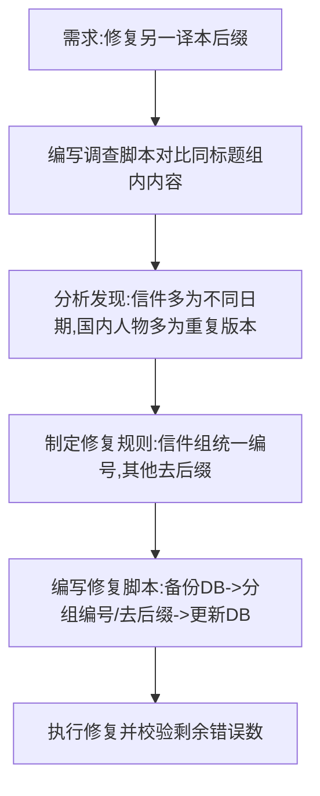

## 任务描述
修复数据库中滥用“（另一译本）”后缀的数据质量问题。

## 执行过程

```mermaid
graph TD
    A[需求:修复另一译本后缀] --> B[编写调查脚本对比同标题组内内容]
    B --> C[分析发现:信件多为不同日期,国内人物多为重复版本]
    C --> D[制定修复规则:信件组统一编号,其他去后缀]
    D --> E[编写修复脚本:备份DB->分组编号/去后缀->更新DB]
    E --> F[执行修复并校验剩余错误数]
```

## 任务总结
通过内容比对发现“另一译本”多为误用。实施差异化修复：
1. 信件组（基底含“致”）：按内容规范化后统一编号（一）、（二）...，跨书同信同号。
2. 非信件组：直接去除“（另一译本）”后缀，保留重复原名。
修复后数据库中“另一译本”残留归零。
