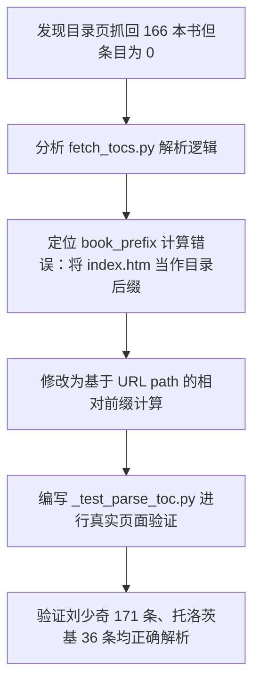

## 任务描述
修复 fetch_tocs.py 中目录页解析逻辑错误，解决文章条目解析为 0 的问题。

## 执行过程

```mermaid
graph TD
    A[发现目录页抓回 166 本书但条目为 0] --> B[分析 fetch_tocs.py 解析逻辑]
    B --> C[定位 book_prefix 计算错误：将 index.htm 当作目录后缀]
    C --> D[修改为基于 URL path 的相对前缀计算]
    D --> E[编写 _test_parse_toc.py 进行真实页面验证]
    E --> F[验证刘少奇 171 条、托洛茨基 36 条均正确解析]
```

## 任务总结
修复了 fetch_tocs.py 的 book_prefix 计算逻辑，使其能正确匹配相对链接。通过测试脚本验证了解析准确性，随后重抓目录页获得 10911 条有效条目。
